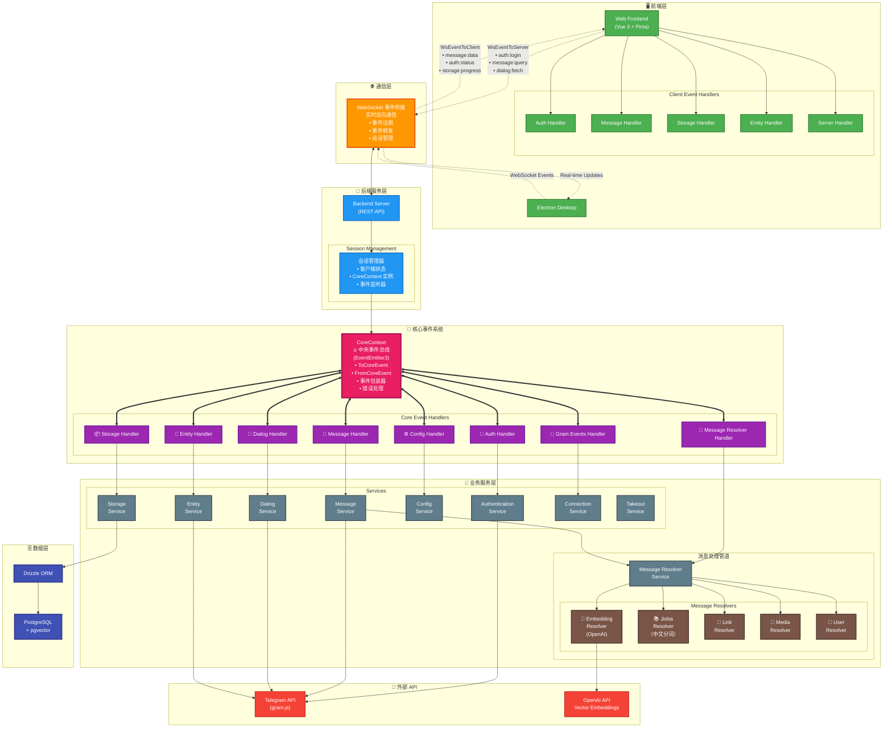

<h1 align="center">Telegram Search</h1>

<p align="center">
  <a href="https://trendshift.io/repositories/13868" target="_blank"></a>
</p>

<p align="center">
  [<a href="https://search.lingogram.app">立即体验</a>] [<a href="https://discord.gg/NzYsmJSgCT">Join Discord Server</a>] [<a href="../README.md">English</a>] [<a href="./README_JA.md">日本語</a>]
</p>

<p align="center">
  <a href="https://app.netlify.com/projects/tgsearch/deploys"></a>
  <a href="https://deepwiki.com/GramSearch/telegram-search"></a>
  <a href="https://github.com/GramSearch/telegram-search/blob/main/LICENSE"></a>
    <a href="https://discord.gg/NzYsmJSgCT"></a>
  <a href="https://t.me/+Gs3SH2qAPeFhYmU9"></a>
</p>

> 我们未发行任何虚拟货币，请勿上当受骗。
>
> 本软件仅可导出您自己的聊天记录以便搜索，请勿用于非法用途。

一个功能强大的 Telegram 聊天记录搜索工具，支持向量搜索和语义匹配。基于 OpenAI 的语义向量技术，让你的 Telegram 消息检索更智能、更精准。

## 💖 赞助者


## 🌐 立即使用

我们提供了一个在线版本，无需自行部署，即可体验 Telegram Search 的全部功能。

> 我们承诺不会收集任何用户隐私数据，您可以放心使用

访问以下网址开始使用: https://search.lingogram.app

## 🚀 快速开始

### 运行时环境变量

启动容器前请准备以下环境变量：

| 变量 | 是否必填 | 说明 |
| --- | --- | --- |
| `TELEGRAM_API_ID` | ✅ | 来自 [my.telegram.org](https://my.telegram.org/apps) 的 Telegram 应用 ID。 |
| `TELEGRAM_API_HASH` | ✅ | 来自同一页面的 Telegram 应用 Hash。 |
| `DATABASE_URL` | ✅ | 后端及迁移脚本使用的 PostgreSQL 连接串。 |
| `EMBEDDING_API_KEY` | ✅ | 向量嵌入提供商的 API Key（OpenAI、Ollama 等）。 |
| `EMBEDDING_BASE_URL` | 选填 | 自建或兼容服务的 API Base URL。 |
| `EMBEDDING_PROVIDER` | 选填 | 指定嵌入服务提供商（`openai` 或 `ollama`）。 |
| `EMBEDDING_MODEL` | 选填 | 覆盖默认的嵌入模型名称。 |
| `EMBEDDING_DIMENSION` | 选填 | 覆盖嵌入向量维度（如 `1536`、`1024`、`768`）。 |
| `PGVECTOR_HOST_PORT` | 选填 | 需要向外暴露数据库时使用的宿主机端口（例如 `15432`）。 |
| `PGVECTOR_HOST_IP` | 选填 | 暴露端口时绑定的宿主机 IP（例如仅监听本地的 `127.0.0.1`）。 |

### 使用 Docker 镜像

1. 携带必要环境变量运行镜像：

```bash
docker run -d --name telegram-search \
  -p 3333:3333 \
  -e TELEGRAM_API_ID=123456 \
  -e TELEGRAM_API_HASH=0123456789abcdef0123456789abcdef \
  -e DATABASE_URL=postgresql://postgres:123456@<postgres-host>:5432/postgres \
  -e EMBEDDING_API_KEY=sk-xxxx \
  -e EMBEDDING_BASE_URL=https://api.openai.com/v1 \
  ghcr.io/groupultra/telegram-search:latest
```

请将 `<postgres-host>` 替换为实际的 PostgreSQL 主机名或 IP 地址。

2. 浏览器访问 `http://localhost:3333` 打开搜索界面。

### 使用 Docker Compose

1. 克隆仓库。

2. 在仓库根目录创建 `.env` 文件，写入上表中的环境变量（仅保留实际需要的条目）。

3. 运行 docker compose 启动包括数据库在内的全部服务：

```bash
docker compose up -d
```

4. 浏览器访问 `http://localhost:3333` 打开搜索界面。

5. 如需向外暴露 pgvector 端口，可在启动时设置 `PGVECTOR_HOST_PORT`：

```bash
PGVECTOR_HOST_PORT=15432 docker compose up -d
```

   如果只想监听本机，可额外设置 `PGVECTOR_HOST_IP=127.0.0.1`。

## 💻 开发教程

### 网页模式

1. 克隆仓库

2. 安装依赖

```bash
pnpm install
```

3. 启动开发服务器：

```bash
pnpm run dev
```

### 后端模式

1. 克隆仓库

2. 安装依赖

```bash
pnpm install
```

3. 修改配置文件

```bash
cp config/config.example.yaml config/config.yaml
```

4. 启动数据库容器：

```bash
# 在本地开发模式下， Docker 只用来启动数据库容器
docker compose up -d pgvector
```

5. 同步数据库表结构：

```bash
pnpm run db:migrate
```

6. 启动服务：

```bash
# 启动后端服务
pnpm run server:dev

# 启动前端界面
pnpm run web:dev
```

## 🏗️ 系统架构



### 事件驱动架构概述

- **🎯 CoreContext - 中央事件总线**：系统核心，使用 EventEmitter3 管理所有事件
  - **ToCoreEvent**：发送到核心系统的事件（如 auth:login, message:query 等）
  - **FromCoreEvent**：从核心系统发出的事件（如 message:data, auth:status 等）
  - **事件包装器**：为所有事件提供自动错误处理和日志记录
  - **会话管理**：每个客户端会话都有独立的 CoreContext 实例

- **🌐 WebSocket 事件桥接**：实时双向通信层
  - **事件注册**：客户端注册想要接收的特定事件
  - **事件转发**：在前端和 CoreContext 之间无缝转发事件
  - **会话持久化**：跨连接维护客户端状态和事件监听器

- **🔄 消息处理管道**：通过多个解析器进行基于流的消息处理
  - **Embedding 解析器**：使用 OpenAI 生成向量嵌入，用于语义搜索
  - **Jieba 解析器**：中文分词，提升搜索能力
  - **链接/媒体/用户解析器**：提取和处理各种消息内容类型

- **📡 事件流程**：
  1. 前端通过 WebSocket 发送事件（如 `auth:login`, `message:query`）
  2. 服务器将事件转发到相应的 CoreContext 实例
  3. 事件处理器处理事件并调用相应的服务
  4. 服务通过 CoreContext 发出结果事件
  5. WebSocket 将事件转发到前端进行实时更新

## 🚀 Activity


[](https://star-history.com/#luoling8192/telegram-search&Date)
